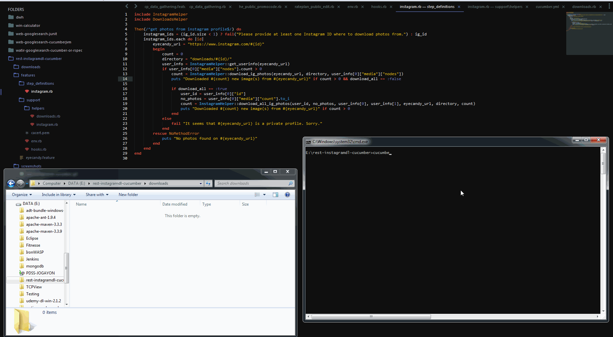

REST-InstagramDL-Cucumber
=========================

Source code for very basic Instagram photos download automation example, using the `rest-client` and `nokogiri` gems, with code written in `Ruby`. Gem dependencies are managed by `Bundler`. This example has an integration with `Cucumber` to provide a way of defining a test description language if desired.

Note: The tool only works for public IG profiles and was only written as an example of simulating a web app via the HTTP layer (for learning purposes).

## Steps

1. Install Ruby and the Ruby Development Kit
2. Clone or download this repository
3. Open a terminal / command line of your choice and navigate to your local repository
4. Run `bundle install` to install gem dependencies
5. Run `cucumber IGID=<ig_profile_id>` to run the tool, which downloads only the latest photos from a person's profile
7. Pass a `DL_ALL=true` command in the tool to download all photos uploaded by that particular person

Author: **Jason Ogayon**